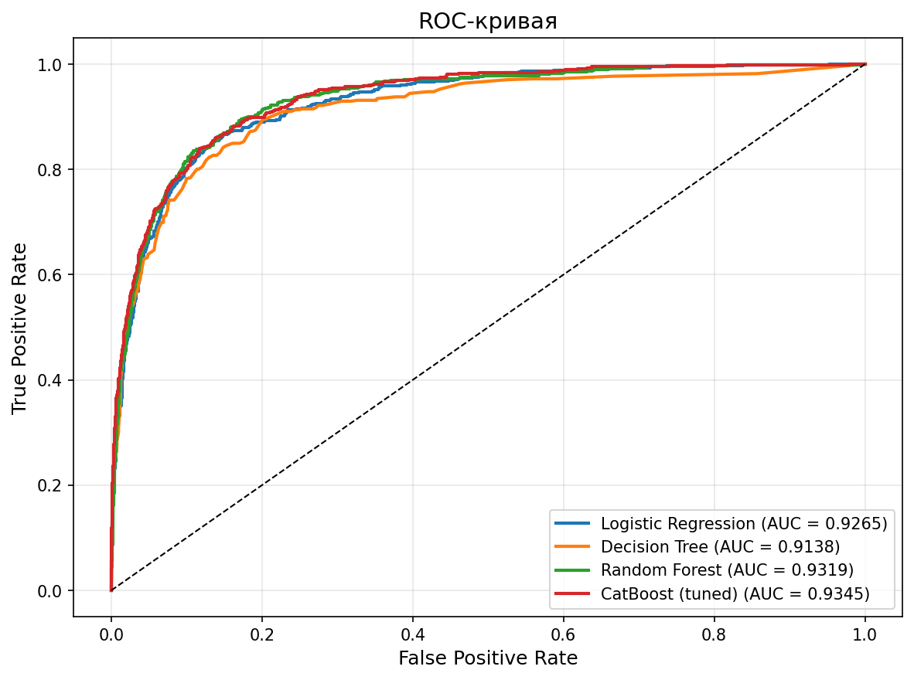
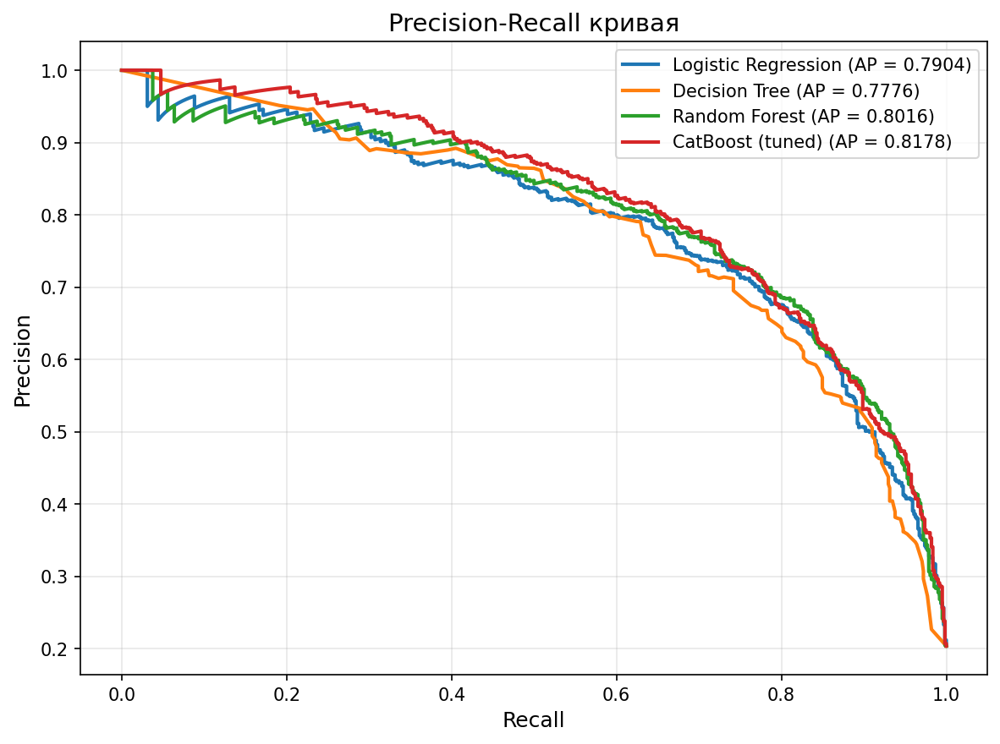
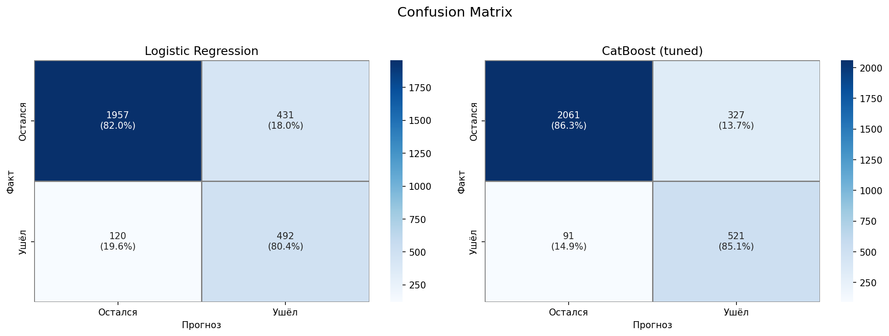
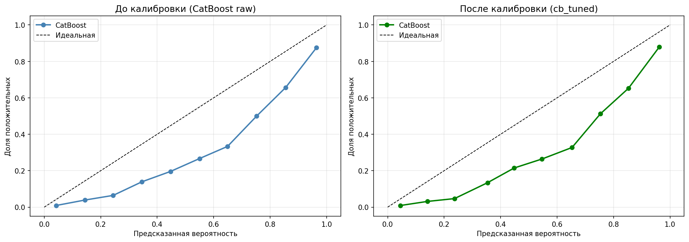
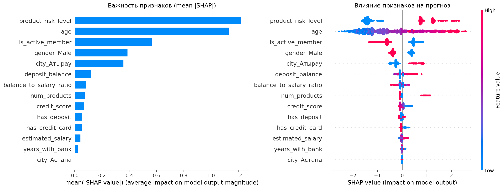

# Bank Customer Churn Prediction

Сервис предсказания вероятности оттока клиентов банка на основе ML-модели CatBoost.
Реализован в виде REST API с документацией Swagger и упакован в Docker-контейнер.

---

## Результаты модели

### Метрики финальной модели (CatBoost tuned + calibrated)

| Метрика    | Значение |
|------------|:--------:|
| ROC-AUC    | 0.9345   |
| Gini       | 0.8690   |
| KS         | ~0.72    |
| AUC-PR     | 0.8172   |
| F1         | 0.7164   |
| Precision  | 0.6167   |
| Recall     | 0.8546   |
| Gap        | 0.0093   |

### Сравнение 9 моделей

| Модель             | Test AUC | Gini  | Gap    |
|--------------------|:--------:|:-----:|:------:|
| CatBoost (tuned)   | 0.9343   | 0.869 | 0.0099 |
| RandomForest       | 0.9319   | 0.864 | 0.0248 |
| CatBoost (base)    | 0.9313   | 0.863 | 0.0455 |
| GradientBoosting   | 0.9310   | 0.862 | 0.0292 |
| LogisticRegression | 0.9265   | 0.853 | -0.0002|
| ExtraTrees         | 0.9265   | 0.853 | 0.0077 |
| LightGBM           | 0.9226   | 0.845 | 0.0754 |
| XGBoost            | 0.9150   | 0.830 | 0.0850 |
| DecisionTree       | 0.9138   | 0.828 | 0.0368 |

### Калибровка

| Метрика     | До     | После  |
|-------------|:------:|:------:|
| Brier Score | 0.1006 | 0.0772 |

---

## Структура проекта

```
churn-prediction/
├── data/
│   ├── raw/                    # Исходные данные (TZ.csv, 15 000 записей)
│   ├── processed/              # Очищенный датасет после EDA
│   └── train_test/             # Train/test сплиты
├── models/
│   ├── pipeline.pkl            # Единый pipeline (preprocessing + модель + метрики)
│   ├── catboost_model.pkl      # CatBoost (без калибровки)
│   ├── catboost_model_calibrated.pkl  # CatBoost (с калибровкой)
│   ├── preprocessing.pkl       # Артефакты препроцессинга
│   └── scaler.pkl              # StandardScaler
├── notebooks/
│   ├── 01_EDA.ipynb            # Разведочный анализ данных
│   ├── 02_preprocessing.ipynb  # Предобработка + Feature Engineering
│   ├── 03_modeling.ipynb       # Обучение, калибровка, сравнение моделей
│   ├── BUSINESS_IMPACT_ANALYSIS.md
│   └── graphs/                 # Визуализации
├── src/
│   ├── app.py                  # FastAPI сервис
│   └── train.py                # Production скрипт обучения
├── Dockerfile
├── docker-compose.yml
├── .dockerignore
├── requirements.txt
└── README.md
```

---

## Запуск

### Docker (рекомендуется)

```bash
git clone https://github.com/justShox/Churn-prediction-api.git
cd Churn-prediction-api
docker compose up --build
```

### Локально

```bash
git clone https://github.com/justShox/Churn-prediction-api.git
cd Churn-prediction-api
pip install -r requirements.txt
python -m uvicorn src.app:app --reload
```

### Остановка Docker

```bash
docker compose down
```

После запуска:
- Сервис: `http://localhost:8000`
- Swagger: `http://localhost:8000/docs`

---

## API

| Метод | Endpoint        | Описание |
|-------|-----------------|----------|
| GET   | `/`             | Статус сервиса |
| GET   | `/health`       | Health check |
| POST  | `/predict`      | Предсказание для одного клиента |
| POST  | `/predict_batch`| Предсказание для нескольких клиентов |

### Запрос

```bash
curl -X POST "http://localhost:8000/predict" \
     -H "Content-Type: application/json" \
     -d '{
       "кредитный_рейтинг": 620,
       "город": "Атырау",
       "пол": "Female",
       "возраст": 48,
       "стаж_в_банке": 3,
       "баланс_депозита": 95000,
       "число_продуктов": 1,
       "есть_кредитка": 1,
       "активный_клиент": 0,
       "оценочная_зарплата": 75000,
       "есть_депозит": 1
     }'
```

### Ответ

```json
{
  "churn_probability": 0.87,
  "prediction": 1,
  "risk_level": "high"
}
```

| Поле | Описание |
|------|----------|
| `churn_probability` | Вероятность оттока (0–1) |
| `prediction` | 1 — уйдёт, 0 — останется |
| `risk_level` | `low` (<0.4), `medium` (0.4–0.7), `high` (>0.7) |

### Переключение калибровки

В `src/app.py`:
```python
USE_CALIBRATED = True   #False = без калибровки
```

### Изменение порога

В `src/app.py`:
```python
pred = int(prob >= 0.5)  # ← меняешь порог
```

---

## Ключевые выводы

### SHAP — топ факторов оттока
1. **Число продуктов** — 1 продукт = высокий риск
2. **Возраст** — старше 45 лет = выше риск
3. **Город Атырау** — 42% оттока vs 15-16% в других
4. **Активность** — неактивные уходят чаще
5. **Пол** — женщины уходят вдвое чаще (28% vs 14%)

### Портрет клиента группы риска
Женщина 45+, из Атырау, неактивная, с 1 продуктом и депозитом.

### Анализ порогов

| Threshold | Precision | Recall | F1    | Specificity |
|-----------|-----------|--------|-------|-------------|
| 0.30      | 0.486     | 0.941  | 0.641 | 0.745       |
| 0.40      | 0.557     | 0.897  | 0.688 | 0.817       |
| 0.50      | 0.617     | 0.855  | 0.716 | 0.864       |
| 0.60      | 0.686     | 0.792  | 0.735 | 0.907       |
| 0.65      | 0.716     | 0.771  | 0.743 | 0.922       |
| 0.70      | 0.746     | 0.729  | 0.737 | 0.936       |

---

## Графики

### ROC-кривая


### Precision-Recall кривая


### Confusion Matrix


### Calibration Curve


### SHAP Feature Importance


---

## Стек

- **ML:** CatBoost, Scikit-learn, SHAP, Optuna, scipy
- **API:** FastAPI, Uvicorn, Pydantic
- **Docker:** Docker, Docker Compose
- **Данные:** Pandas, NumPy, Matplotlib, Seaborn
